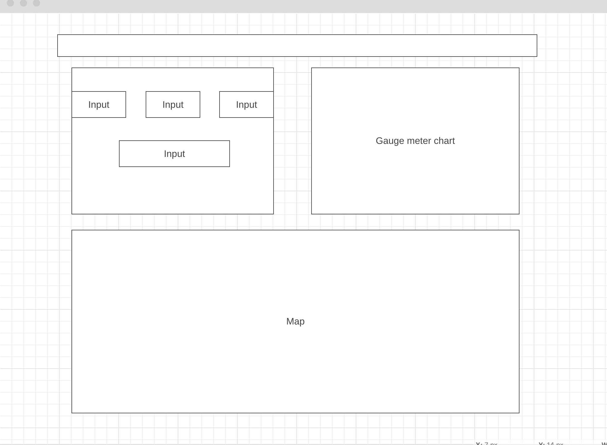

## Summary
overThumbInvestment is a calculation tool for real estate investors. It gives them a rough overview of the investment option by calculating the basic financing KPI's for a property. This helps them to get a first and quick evaluation of the investment option.

[take a look ](https://janviefhues.github.io/))

## Background
Making quick decisions is a very important capability when it comes to investment opportunities. Investors have to evaluate possible options really fast to close the deal before other investors do.

With overThumbInvestment investors can enter all necessary property and financing data needed to do a basic profitability analysis. They can play around with different input data and see the changes dynamically in well visualised graphs. This will give them the opportunity to evaluate an investment option by playing around with various input data. Also user are getting comparable market figures from properties of Germany's major cities.

### Chart 1)

Visualisation of the profitability presents in the net income rate -> illustrated in a speedometer type
Needle dynamically change by changing input data
Show the average net income rate for the city based on user selection

### Chart 2)
Visualisation of the average property data from the 15 major german cities in a dynamic map
Cities are shown with a marker on the map
By hover user sees figures
Functionality & MVP
#### User is able to:
Input property data (price/square meter, square meter of property, rent/square meter, city)
Can change property input data while set fields stays static (e.g. only change renter) and see the changes dynamically in chart
Can hover over different cities on the map to see average data to get a overview of the german market

## Wireframes

### Architecture and Technologies
This project will be implemented with the following technologies:

JavaScript for calculation logic and data input
D3 for graph visualisation
Leaflet with openStreetMap
Webpack to bundle js files
Besides the entry file there will be a two scripts involved:

properties.js This script will handle the logic for updating the necessary elements with the input data from the user and pass the result to the graph
map.js This script will handle the logic for updating the average market data based on user selection
Implementation Timeline

#### Day 1:
Research about how to use D3 and think about logic

#### Day 2:
Set up the project structure (files) and implementing the calculation logic

#### Day 3:
Developing the charts

#### Day 4:
Still developing the charts