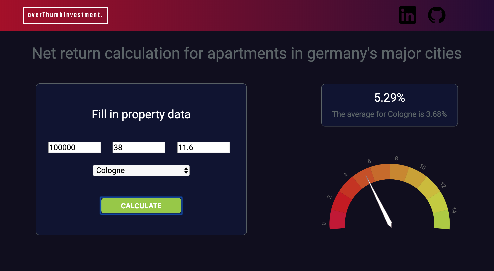
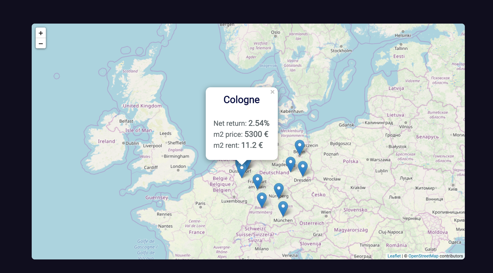
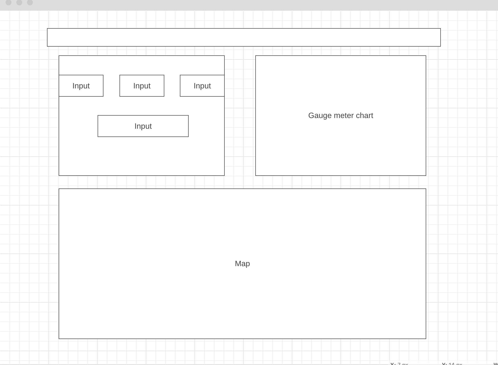

## Summary
overThumbInvestment is a calculation tool for real estate investors. It gives them a rough overview of the investment option by calculating the basic financing KPI's for a property. This helps them to get a first and quick evaluation of the investment option.

[take a look ](https://janviefhues.github.io/overThumbLive/)

## Background
Making quick decisions is a very important capability when it comes to investment opportunities. Investors have to evaluate possible options really fast to close the deal before other investors do.

With overThumbInvestment investors can enter all necessary property and financing data needed to do a basic profitability analysis. They can play around with different input data and see the changes dynamically in well visualised graphs. This will give them the opportunity to evaluate an investment option by playing around with various input data. Also user are getting comparable market figures from properties of Germany's major cities.

## Overview & Functionality

### Chart 1)

Visualisation of the profitability presents in the net income rate -> illustrated in a speedometer type
Needle dynamically change by changing input data
Show the average net income rate for the city based on user selection

#### User can
- Input property data (price/square meter, square meter of property, rent/square meter, city) to get calculation
- Change property input data while set fields stays static (e.g. only change renter) and see the changes dynamically in chart.

### Chart 2)
Visualisation of the average property data from the 15 major german cities in a dynamic map.
Cities are shown with a marker on the map. By hover user sees figures


#### User can
- Hover over different cities on the map to see average data to get an overview of the german market

## Wireframes


## File structure and code snippets
Besides the entry file there will be a two scripts involved:

## properties.js 
This script will handle three major parts: 

#### I. Creating the gauge chart and render it on the DOM

#### II. Getting form input data and calculate the net return
The form input is fetched using "getElementById" selector and get then 
stored in the  `propertyData`object.
``` javascript
let propertyData`;
const _calculateIncomeRate = propertyData => {
  let rent = propertyData.size * propertyData.squareMeterRent * 12; // total rent / year
  let rate = (rent / propertyData.price) * 100; // calculate incomeRate
  let roundedRate = rate.toFixed(2);
  console.log(`${roundedRate} %`); //`${roundedRate} %`;

  return roundedRate;
};
```

The `__calculateIncomeRate` helper function takes this objects and does the calculation.
``` javascript
const getInput = event => {
  event.preventDefault();
  propertyData = {
    price: document.getElementById("priceInput").value,
    size: document.getElementById("squareMetersInput").value,
    squareMeterRent: document.getElementById("rentInput").value
  };
´´´

#### III. Set click Eventlistener and display net return element on the DOM

Step 1: Input field validation
- Data for calculation is required
``` javascript
if (!propertyData.price && !propertyData.size && !propertyData.squareMeterRent) {
    let FormVal = document.createElement("h2");
    FormVal.setAttribute("id", "validation-input");
    FormVal.innerHTML = "Please fill in porperty data";
    document.getElementById("validations").appendChild(FormVal);`
```

Step 2: Render net return rate on DOM and update Gauge chart
- If input is valid the net return rate gets rendert on the DOM 
- Because the user can dynamically change a input field the return element  changes
- To update this element on the DOM the old element (oldEle) gets removed and the new result displayed 
``` javascript
 else {
           let oldEle = document.getElementById("IncomeRate");
           if (oldEle) oldEle.remove();

           let result = document.createElement("h2");
           result.setAttribute("id", "IncomeRate");

           result.innerHTML = incomeRate + "%";
           document.getElementById("Your-return-rate").appendChild(result);
           updateGauge(powerGauge, incomeRate);
         }
```
### Architecture and Technologies
This project is implemented with the following technologies:

- Plain _JavaScript_ for calculation logic and data input
- _D3_ for graph visualisation
- _Leaflet_ with _openStreetMap_ for map integration
- _Webpack_ to bundle js files


